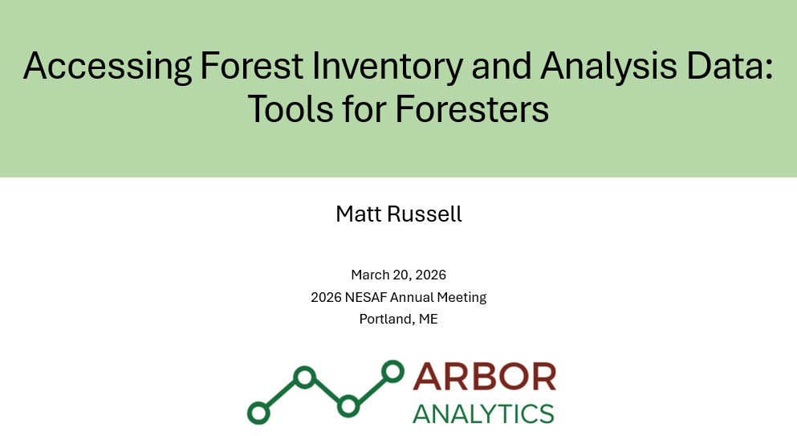

# fia_nesaf26

Resources for the workshop **Accessing Forest Inventory and Analysis (FIA): Tools for Foresters**. Delivered at the New England Society of American Foresters Annual Meeting, March 20, 2026, South Portland, ME.

## Background
The Forest Inventory and Analysis (FIA) program within the USDA Forest Service collects a tremendous amount of data on the status and trends of forest conditions. These data are publicly available and exist in a variety of formats, but foresters and forest managers often require customized data that is summarized in a way that solves a specific problem. This workshop will provide an overview of how FIA data are collected across New England’s forests and will share practical approaches for downloading, querying, and interpreting FIA data for customized applications and reporting needs.    

## Intended audience
Foresters, forest managers, forest analysts, students

## Learner outcomes 

### Session 1: 	
(1) Understand the general framework for how FIA data are collected, e.g., sample intensity, core measurements, and length of measurement cycles.   
(2) Be able to identify the strengths and limitations of FIA data collection methods and interpretation. 
(3) Learn how to access state-level reports and other reporting tools that summarize forest conditions and trends. 

### Session 2: 
(1) Understand how to find and utilize specific FIA data tables for specific information needs.  
(2) Become comfortable with using the web-based EVALIDator as a tool to create customized summaries of forest conditions.  
(3) Understand how to use the EVALIDator API for accessing FIA data using R and Python programming languages.   

